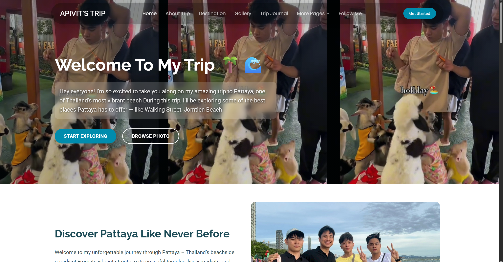
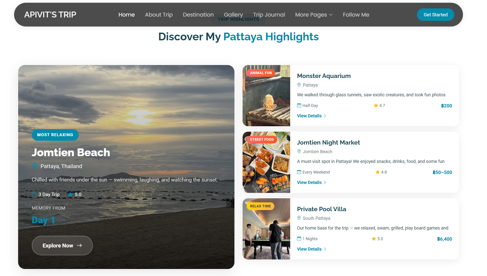

# 🌐 02 Web Programming

โปรเจกต์นี้เป็นงานวิชา **Web Programming** ที่พัฒนาเว็บเพจพื้นฐานด้วย **HTML, CSS และ JavaScript**  
มีการออกแบบโครงสร้างหน้าเว็บจาก **Template BootstrapMade** พร้อมปรับปรุงฟอร์มและองค์ประกอบต่าง ๆ  
เพื่อเรียนรู้การทำงานของภาษา Web Technology และการนำไปใช้งานจริง

---

## ✨ Features

- 📄 โครงสร้างเว็บด้วย **HTML5**
- 🎨 การตกแต่งด้วย **CSS3**
- ⚡ เพิ่มความโต้ตอบ (Interaction) ด้วย **JavaScript**
- 📱 รองรับการใช้งานทั้ง Desktop และ Mobile (**Responsive Design**)
- 🎨 ใช้ **Bootstrap Template** เป็นฐานการพัฒนา

---

## 📂 Project Structure

```
02WebProgramming/
│── index.html        # หน้าเว็บหลัก
│── style.css         # ไฟล์ตกแต่ง (CSS)
│── script.js         # ไฟล์ JavaScript
│── 01_preview/       # โฟลเดอร์รวมภาพตัวอย่างหน้าเว็บ
```

---

## 🚀 How to Use

1. Clone repository
   ```bash
   git clone https://github.com/IceEz555/02WebProgramming.git
   cd 02WebProgramming
   ```

2. เปิดไฟล์ `index.html` ด้วย Browser (Chrome, Edge, Firefox, Safari)

หรือสามารถดูผ่านเว็บ Deploy ได้ที่นี่:  
👉 **[View Live](https://02-web-programming.vercel.app/)**

---

## 🖼️ Preview

ตัวอย่างหน้าเว็บจากโฟลเดอร์ **01_preview**

  
  

---

## 📜 Template Credits

ขอบคุณ Template ที่ใช้ในการพัฒนา:  
- **Template Name:** Tour  
- **Template URL:** [https://bootstrapmade.com/tour-bootstrap-travel-website-template/](https://bootstrapmade.com/tour-bootstrap-travel-website-template/)  
- **Author:** BootstrapMade.com  
- **License:** [https://bootstrapmade.com/license/](https://bootstrapmade.com/license/)  

---

## 👤 Author

พัฒนาโดย **IceEz555**  
📌 GitHub: [IceEz555](https://github.com/IceEz555)  
